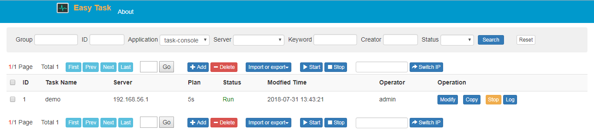
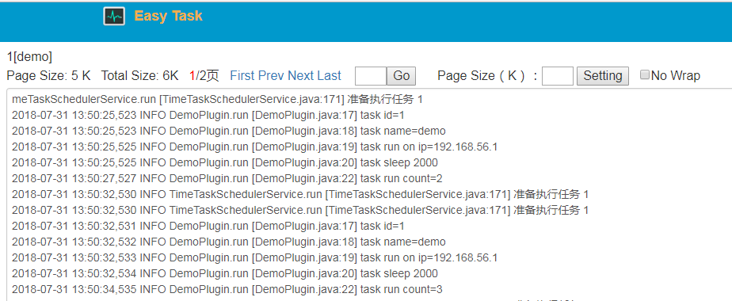
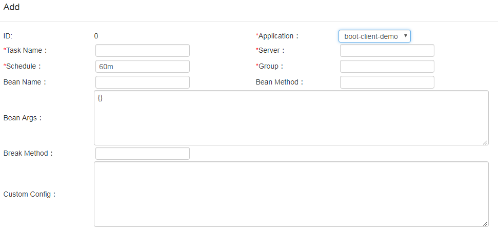

<a style="text-align: right;" href="docs/readme_cn.md">Chinese Version</a>
#Easy Task

It is an easy to use distributed task scheduling platform. It is derived from Taobao lottery scheduling platform and has been used in the Taobao content crawling platform and The Tiejia Used Equipment Of Construction Machinery task scheduling platform. It is currently refactored and open source. It has the following characteristics:
- Decentralization.
- Support applying to hundreds of application server for different services. Tasks are executed independently on each application, taking full advantage of the application's own resources.
- Failover. If the application has multiple execution machines, one machine hangs and the tasks on it will switch to other machines.
- The management console unifies modification, start and stop the task, and so on. Hanging out of the console does not affect the execution of the task.
- You can view the task log online to get a real-time view of task execution.

### What are the advantages of this scheduling platform?
- The general task scheduling system, the code logic is integrated into the scheduling system, it is necessary to move the business system scheduling code and dependent code into the scheduling system, which is very troublesome. However, Easy Task is only responsible for scheduling, and the complex code logic is still developed and executed in the respective business systems, ensuring the efficiency of development and avoiding the influence of business systems.
- You can view the execution logs of all tasks online by page, and task execution is no longer a black box.<br/>


### First quick experience
If you have several business systems (as worker) that want to use the task scheduling platform, you can download and launch a console directly. The console is also a worker, and can also execute tasks. By default, a demoPlugin task for the demo is started (the actual scene console is only managed, not task execution).
- Download and start <br/>
Download from the release or download the executable jar file directly https://github.com/cehome-com/resource/raw/master/easy-task/2.0.3/task-console.jar <br/>
Then execute the command to start:  java -jar task-console.jar
- Visit http://localhost:8080 and you can see a demo task <br/>



- Task Management. <br/>
Click the "Log" button, you can see the task execution log (if not, you can stop for 10 seconds and then refresh)<br/>



Click "Modify" to view or modify the task configuration. The system is based on spring, and the bean name "demoPlugin" is a built-in spring bean.<br/>
Click "Stop" to stop the task.
- For the service system applying, see below how to apply to the “spring boot” and “sring mvc” applications.


### Second quick experience
If you only want to quickly deploy a simple and usable scheduling system, you don't need to consider the existing business system, you can directly use the task-console source code development.
- Check out the task-console spring boot code module, import it into the IDE, and execute com.cehome.task.console.TaskConsoleApplication for start.
- Visit http://localhost:8080
- Click the "Log" button to view the log of the built-in demoPlugin task.
- Modify the demoPlugin corresponding class com.cehome.task.console.DemoPlugin to redeploy and view the execution results.


### Simulate scheduling platform is applied to business system (worker).
In actual use, the console is just an administrative task, no tasks are executed, and tasks are executed in the business system. The following simulates scheduling platform is applied to two service systems named "app1" and "app2". For convenience, still use the task-console.jar for simulation. Before proceeding, first make sure that the above console is still running.
- Launch another command line window and execute commands as follows for the start of app1 (port 8091) <br/>
java -jar task-console.jar --task.factory.appName=app1 --server.port=8091
- Launch another command line window and execute commands as follows for the start of app1 (port 8092) <br/> 
java -jar task-console.jar --task.factory.appName=app2 --server.port=8092
- Switch the task to app2 to execute. Go to http://localhost:8080, click the "Modify" button, pop up the modification page, click the "Application" drop-down box, you should be able to see APP1, APP2 is also inside, select APP2, then save and close.
- Observe the command line output window of app2 and find that the demo has been transferred to app2 for execution.

### The scheduling platform is applied to existing spring boot application.
Use the task-spring-boot-client-demo module to explain how to apply the scheduling platform to the spring boot application.
- Increase dependence
        
```
<dependency>
    <groupId>com.cehome</groupId>
    <artifactId>task</artifactId>
    <version>2.0.3</version>
</dependency>
```

- Join the @EnableTimeTaskClient annotation

```
package com.cehome.task.client.demo;

import com.cehome.task.annotation.EnableTimeTaskClient;
import org.springframework.boot.SpringApplication;
import org.springframework.boot.autoconfigure.SpringBootApplication;

@SpringBootApplication
@EnableTimeTaskClient
public class BootApplication {
    public static void main(String[] args) {
        SpringApplication.run(BootApplication.class,args);
    }

}
```

- Modify the configuration file named "application.properties" <br/> 
Description of the requirements configuration: <br/> <br/>
task.factory.appName - The application name, which should be different for different applications. <br/> <br/> 
task.factory.name - The name of the cluster, which is also the name of the database table. Do not arbitrarily change it after you have made it.  <br/> <br/>
task.datasource.* Configure database information to support H2 and mysql databases. It is recommended that the production environment use the mysql database. <br/> <br/> 
task.log.path - logback task log output path. <br/> <br/>
Task.log.packages - The package name of the task execution class, used for logging. Multiple package names are separated by a semicolon. If it is not sure, use the ROOT root log.

```
spring.application.name=boot-client-demo
server.port=8081

#------  main options --------
#应用的名称
task.factory.appName=boot-client-demo
#集群名称(同时也是数据库表名)
task.factory.name=easy_task

#h2数据库配置
task.datasource.driverClassName=org.h2.Driver
task.datasource.url=jdbc:h2:tcp://localhost:9092/~/easy_task_db;MODE=MYSQL
task.datasource.username=sa
task.datasource.password=

#------  client options --------
task.log.packages=ROOT
task.log.path=/logs/easy_task/boot_demo
```

- Development task plugin <br/>
The task plugin can extend com.cehome.task.client.TimeTaskPlugin. Since the execution method named "run()" is fixed, you can not specify the method name when configuring the task information in the console. The stop() method fires when the stop task is clicked, and the code application stops the task execution and releases the necessary resources.

```
package com.cehome.task.client.demo;

import com.alibaba.fastjson.JSONObject;
import com.cehome.task.client.TimeTaskContext;
import com.cehome.task.client.TimeTaskPlugin;
import org.slf4j.Logger;
import org.slf4j.LoggerFactory;
import org.springframework.stereotype.Component;

import java.net.Inet4Address;

@Component
public class BootDemoPlugin extends TimeTaskPlugin {
    private static final Logger logger = LoggerFactory.getLogger(BootDemoPlugin.class);
    @Override
    public void run(TimeTaskContext context, JSONObject args) throws Exception {
        logger.info("plugin class name="+this);
        logger.info("task id="+context.getId()+",name="+context.getName());
        logger.info("task run on ip="+ Inet4Address.getLocalHost().getHostAddress());
        logger.info("task run count="+context.getRunTimes());
    }

    @Override
    public void stop(TimeTaskContext context) throws Exception {
        logger.info("task "+context.getName()+" is stopped ");
    }
}
```

The task plugin can also be a normal spring bean, but when configuring the task information in the console, you need to specify the method to be executed.
- Start the application task-spring-boot-client-demo
- Visit http://localhost:8080 (make sure the console is the state of starting), click on the "Add" task, "Application" select "boot-client-demo"; plan time to fill in 5s (5 seconds); Bean name and above the developed plugin is consistent, fill in the "bootDemoPlugin"; other required fields are fill in at random <br/>



- Save and close, click "Start", then click "Log" button after more than 10 seconds, if you see the log of "task run...", everything is fine.


### The scheduling platform is applied to existing spring mvc application
Use the task-spring-mvc-client-demo module to explain .
- Increase dependence
        
```
<dependency>
            <groupId>com.cehome</groupId>
            <artifactId>task</artifactId>
            <version>2.0.3</version>
        </dependency>
```

- Import the bean in the spring.xml file:

```
<import resource="classpath*:task-client-spring-config.xml"></import>
```

- Introducing spring/config.properties configuration information in spring.xml
 
```
<context:annotation-config/>
    <context:property-placeholder location="classpath*:spring/config.properties"/>
```


- Add configuration information in the corresponding spring/config.properties:  <br/> <br/>
task.factory.appName - The application name, which should be different for different applications.  <br/> <br/> 
task.factory.name - The name of the cluster, which is also the name of the database table. Do not arbitrarily change it after you have made it.  <br/> <br/>
task.datasource.* Configure database information to support H2 and mysql databases. It is recommended that the production environment use the mysql database.  <br/> <br/>
task.log.path - logback task log output path.  <br/> <br/> 
task.log.packages - is the package’s name of the task execution class, used for logging. Multiple package names are separated by a semicolon. If it is not sure, use the ROOT root log.  

```
task.factory.appName=mvc-client-demo
task.factory.name=easy_task

#h2
task.datasource.driverClassName=org.h2.Driver
task.datasource.url=jdbc:h2:tcp://localhost:9092/~/easy_task_db;MODE=MYSQL
task.datasource.username=sa
task.datasource.password=

#------  client options --------
task.log.packages=com.cehome.task.client.demo
task.log.path=/logs/easy_task/mvc_demo
```


- Configure the controller of remote online log view in file named "springmvc.xml". Without this controller, the console cannot connect to the application to view the log online.
	
```
<context:component-scan
			base-package="com.cehome.task.client.controller"/>
	<mvc:annotation-driven />
```

- Development task plugin <br/> 
The task plugin can extend com.cehome.task.client.TimeTaskPlugin. Since the execution method named "run()" is fixed, you can not specify the method name when configuring the task information in the console. The stop() method fires when the stop task is clicked, and the code application stops the task execution and releases the necessary resources.

```
package com.cehome.task.client.demo;

import com.alibaba.fastjson.JSONObject;
import com.cehome.task.client.TimeTaskContext;
import com.cehome.task.client.TimeTaskPlugin;
import org.slf4j.Logger;
import org.slf4j.LoggerFactory;
import org.springframework.stereotype.Component;

import java.net.Inet4Address;

@Component
public class MvcDemoPlugin extends TimeTaskPlugin {
    private static final Logger logger = LoggerFactory.getLogger(MvcDemoPlugin.class);
    @Override
    public void run(TimeTaskContext context, JSONObject args) throws Exception {
        logger.info("plugin class name="+this);
        logger.info("task id="+context.getId()+"task name="+context.getName());
        logger.info("task run on ip="+ Inet4Address.getLocalHost().getHostAddress());
        logger.info("task run count="+context.getRunTimes());
    }

   @Override
    public void stop(TimeTaskContext context) throws Exception {
        logger.info("task "+context.getName()+" is stopped ");
    }
}
```

The task plugin can also be a normal spring bean, but when configuring the task information in the console, you need to specify the method to be executed.
- Add the scan path of the plugin in spring.xml
  
```
<context:component-scan  base-package="com.cehome.task.client.demo"/>
```

- Launch the application named "task-spring-mvc-client-demo"
- Visit console (not mvc-demo) http://localhost:8080 (make sure the console is the state of starting), click on the "Add" task, select "mvc-client-demo" for the application; fill in 5s (5 seconds) of the scheduled time; The bean name is the same as the above development plugin, fill in the "mvcDemoPlugin"; other required fields are fill in at random.
- Save and close, click "Start", then click "Log" button after more than 10 seconds, if you see the log of "task run..." , everything is fine.


### Use An External Database
By default, the console starts an internal database, and the production environment recommends using an external database. Still use the H2 database to illustrate:
- Start the H2 database <br/>
Go to http://www.h2database.com/html/download.html and download the h2 database and extract it. Go to the “bin” directory and execute the command to start the database (9092 is the database access port).<br/>
java -cp h2*.jar org.h2.tools.Server -tcpPort 9092 -tcpAllowOthers -webPort 8082 -webAllowOthers
- Modify the console or client database configuration information

```
task.datasource.driverClassName=org.h2.Driver
task.datasource.url=jdbc:h2:tcp://192.168.0.10:9092/~/easy_task_db;MODE=MYSQL
task.datasource.username=sa
task.datasource.password=
```

If it is a console, you can modify “task.h2.start=false” to disable the internal database.

```
task.h2.start=false
```


### Mysql Database Configuration Reference

```
task.datasource.driverClassName=com.mysql.jdbc.Driver
task.datasource.url=jdbc:mysql://192.168.0.13:3306/scheduler?useUnicode=true&characterEncoding=utf8&allowMultiQueries=true
task.datasource.username=root
task.datasource.password=123456
```


### Best Practice Advice
- Independent mysql database
- Console has at least two nodes
- Several applications, each application maintains at least two nodes


### Languages  
English(en) and chinese(cn) is supported. Default is english, 
Add "**language=cn**" to application.properties to enable chinese.